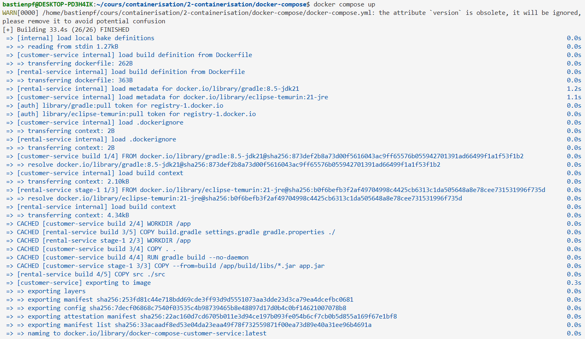
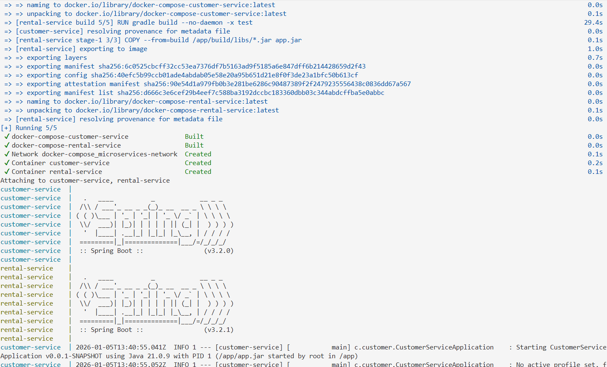
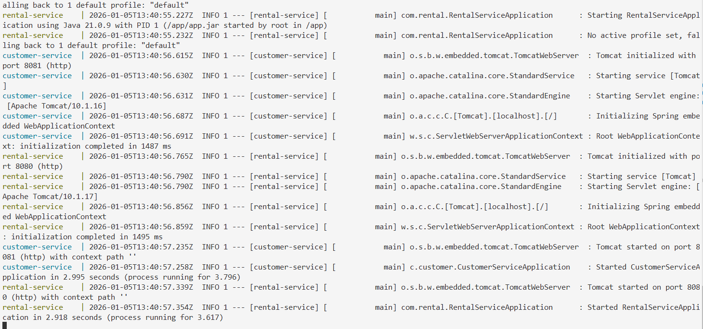
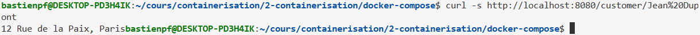
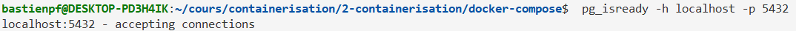

# Projet Docker #2

## Introduction
Ce projet consistait à build 2 microservices Java dans 1 docker compose, et à vérifier que l'un puisse communiquer avec le second.
Comme dans mon premier projet, les Dockerfile des 2 microservices buildent les projets Java avant la création de l'image (dans les fichiers Dockerfile)

## Run le projet :

> docker compose up
ou 
> docker compose up -d

*resultat du build / run*




Pour arreter les containers :

> docker compose down
(ou ctrl + c si le container était lancé en mode detached (-d))

### Test :
On peut tester la methode "bonjour" de notre microserice 'RentaService' pour vérifier qu'il appelle bien le microservice customer :

> curl -s http://localhost:8080/customer/Jean%20Dupont

*l'appel renvoit :*


## Bonus : BDD avec volumes

Je ne connais pas bien java, donc je n'ai pas créé de connection entre mes microservices et ma database.
Cependant j'ai quand meme créé une database PostgreSQL dans mon docker compose, et un volume associé.

Les informations d'environement de la database sont définies dans le .env

### Teste de la connection avec la database :
On peut tester la connection avec la, database avec la commande suivant : pg_isready.
On peut la run dans le container :

> docker exec ef1ca81e243d66598c50ebd0887022528a076281b316f3e509d5d8e61bbbbcff pg_isready


Pour tester si le port à été mappé correctement, on peut faire :

> pg_isready -h localhost -p 5432


/!\ important /!\
Les lignes
```bash
    volumes:
      # we SHOULD define an entrypoint script here to initialize the database when we create the volume
      - postgres_data:/var/lib/postgresql
```
font référence à la section du dockerfile suivante :
```bash
volumes:
  postgres_data:
    driver: local
```
Cela indique que les datas de la database sont stocké localement dans les fichiers de docker (chemin par défault)

## Docker Image

J'ai créé une image docker pour les 2 images des microservices de mon docker-compose :
https://hub.docker.com/r/bipief/docker-compose-rental-service

